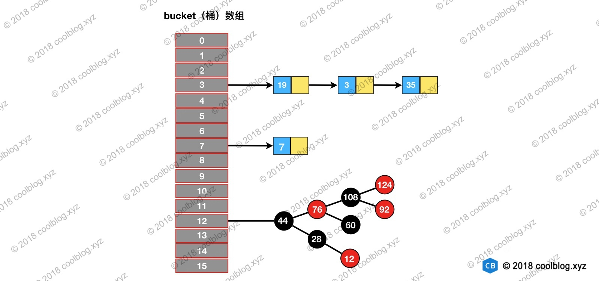

# HashMap 源码分析（JDK 1.8）

## 1. 概述

HashMap 最早出现在 JDK 1.2中，底层基于散列算法实现。HashMap 允许 null 键和 null 值，在计算哈键的哈希值时，null 键哈希值为 0。HashMap 并不保证键值对的顺序，这意味着在进行某些操作后，键值对的顺序可能会发生变化。另外，需要注意的是，HashMap 是非线程安全类，在多线程环境下可能会存在问题。

在本篇文章中，我将会对 HashMap 中常用方法、重要属性及相关方法进行分析。需要说明的是，HashMap 源码中可分析的点很多，本文很难一一覆盖，请见谅。

------

## 2. 原理

上一节说到 HashMap 底层是基于散列算法实现，散列算法分为散列再探测和拉链式。HashMap 则使用了拉链式的散列算法，并在 JDK 1.8 中引入了红黑树优化过长的链表。数据结构示意图如下：



对于拉链式的散列算法，其数据结构是由数组和链表（或树形结构）组成。在进行增删查等操作时，首先要定位到元素的所在桶的位置，之后再从链表中定位该元素。比如我们要查询上图结构中是否包含元素`35`，步骤如下：

1. 定位元素`35`所处桶的位置，`index = 35 % 16 = 3`
2. 在`3`号桶所指向的链表中继续查找，发现35在链表中。

上面就是 HashMap 底层数据结构的原理，HashMap 基本操作就是对拉链式散列算法基本操作的一层包装。不同的地方在于 JDK 1.8 中引入了红黑树，底层数据结构由`数组+链表`变为了`数组+链表+红黑树`，不过本质并未变。好了，原理部分先讲到这，接下来说说源码实现。

------

## 3. 源码实现

本篇文章所分析的源码版本为 JDK 1.8。与 JDK 1.7 相比，JDK 1.8 对 HashMap 进行了一些优化。比如引入红黑树解决过长链表效率低的问题。重写 resize 方法，移除了 alternative hashing 相关方法，避免重新计算键的 hash 等。不过本篇文章并不打算对这些优化进行分析，本文仅会分析 HashMap 常用的方法及一些重要属性和相关方法。

### 3.1 构造方法

#### 3.1.1 构造方法分析

HashMap 的构造方法不多，只有四个。HashMap 构造方法做的事情比较简单，一般都是初始化一些重要变量，比如 loadFactor 和 threshold。而底层的数据结构则是延迟到插入键值对时再进行初始化。HashMap 相关构造方法如下：

```java
/** 构造方法 1 */
public HashMap() {
    this.loadFactor = DEFAULT_LOAD_FACTOR; // all other fields defaulted
}

/** 构造方法 2 */
public HashMap(int initialCapacity) {
    this(initialCapacity, DEFAULT_LOAD_FACTOR);
}

/** 构造方法 3 */
public HashMap(int initialCapacity, float loadFactor) {
    if (initialCapacity < 0)
        throw new IllegalArgumentException("Illegal initial capacity: " +
                                           initialCapacity);
    if (initialCapacity > MAXIMUM_CAPACITY)
        initialCapacity = MAXIMUM_CAPACITY;
    if (loadFactor <= 0 || Float.isNaN(loadFactor))
        throw new IllegalArgumentException("Illegal load factor: " +
                                           loadFactor);
    this.loadFactor = loadFactor;
    this.threshold = tableSizeFor(initialCapacity);
}

/** 构造方法 4 */
public HashMap(Map<? extends K, ? extends V> m) {
    this.loadFactor = DEFAULT_LOAD_FACTOR;
    putMapEntries(m, false);
}
```

上面4个构造方法中，大家平时用的最多的应该是第一个了。第一个构造方法很简单，仅将 loadFactor 变量设为默认值。构造方法2调用了构造方法3，而构造方法3仍然只是设置了一些变量。构造方法4则是将另一个 Map 中的映射拷贝一份到自己的存储结构中来，这个方法不是很常用。

上面就是对构造方法简单的介绍，构造方法本身并没什么太多东西，所以就不说了。接下来说说构造方法所初始化的几个的变量。

#### 3.1.3 初试容量、负载因子、阈值

我们在一般情况下，都会使用无参构造方法创建 HashMap。但当我们对时间和空间复杂度有要求的时候，使用默认值有时可能达不到我们的要求，这个时候我们就需要手动调参。在 HashMap 构造方法中，可供我们调整的参数有两个，一个是初始容量 initialCapacity，另一个负载因子 loadFactor。通过这两个设定这两个参数，可以进一步影响阈值大小。但初始阈值 threshold 仅由 initialCapacity 经过移位操作计算得出。他们的作用分别如下：

| 名称            | 用途                                                         |
| --------------- | ------------------------------------------------------------ |
| initialCapacity | HashMap 初始容量                                             |
| loadFactor      | 负载因子                                                     |
| threshold       | 当前 HashMap 所能容纳键值对数量的最大值，超过这个值，则需扩容 |

相关代码如下：

```java
/** The default initial capacity - MUST be a power of two. */
static final int DEFAULT_INITIAL_CAPACITY = 1 << 4;

/** The load factor used when none specified in constructor. */
static final float DEFAULT_LOAD_FACTOR = 0.75f;

final float loadFactor;

/** The next size value at which to resize (capacity * load factor). */
int threshold;
```

先做题，日后再说～